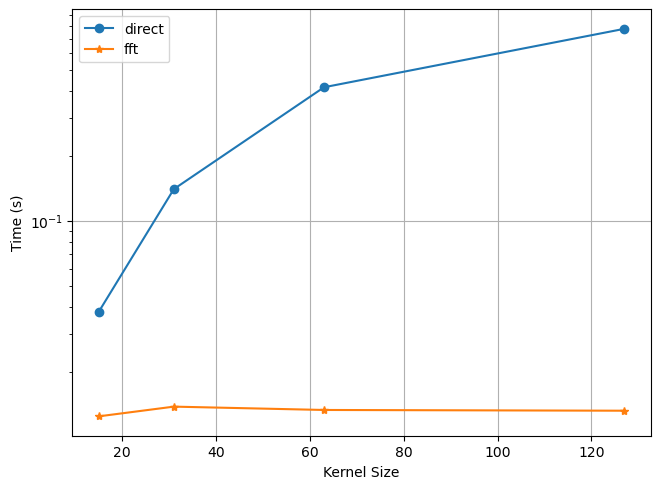

# FFT Conv PyTorch

[](https://github.com/yoyolicoris/torch-fftconv/actions/workflows/python-package.yml)
[](https://github.com/yoyolicoris/torch-fftconv/actions/workflows/python-publish.yml)
[](https://badge.fury.io/py/torch-fftconv)

This is a fork of [fft-conv-pytorch](https://github.com/fkodom/fft-conv-pytorch).
I made some modifications to support dilated, strided, and transposed convolution, so it can be a drop-in-replacement of original PyTorch `Conv*d` modules and `conv*d` functions, with the same behaviour and interface. 

### Install

```commandline
pip install torch-fftconv
```

### Example Usage

```python
import torch
from torch_fftconv import fft_conv1d, FFTConv1d

signal = torch.randn(3, 3, 1024 * 1024)
kernel = torch.randn(2, 3, 128)
bias = torch.randn(2)

# Functional execution.  (Easiest for generic use cases.)
out = fft_conv1d(signal, kernel, bias=bias)

# Object-oriented execution.  (Requires some extra work, since the 
# defined classes were designed for use in neural networks.)
fft_conv = FFTConv1d(3, 2, 128, bias=True)
out = fft_conv1d(signal)

# Supposedly you want to replace an existing convolution layer in a neural network with FFTConv, you can do it like this:
m: torch.nn.Module = ...  # some existing model
from torch_fftconv.utils import convert_fft_conv
m = convert_fft_conv(m)  # this will replace all Conv/TransposedConv layers in m with FFTConv layers, and copy the weights and bias.
```

## Benchmarks

The best situation to use `FFTConv` is when using large size kernel. The following image shows that when the size of input is fixed, the fft method remains an almost constant cost among all size of kernel, regardless.



For details and benchmarks on other parameters, check [this notebook](benchmark.ipynb).

## Features

- ~~[ ] Jittability.~~
- [x] Dilated Convolution.
- [x] Transposed Convolution.
- [x] Support complex input and kernel.